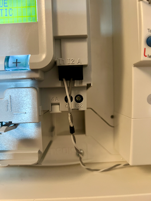
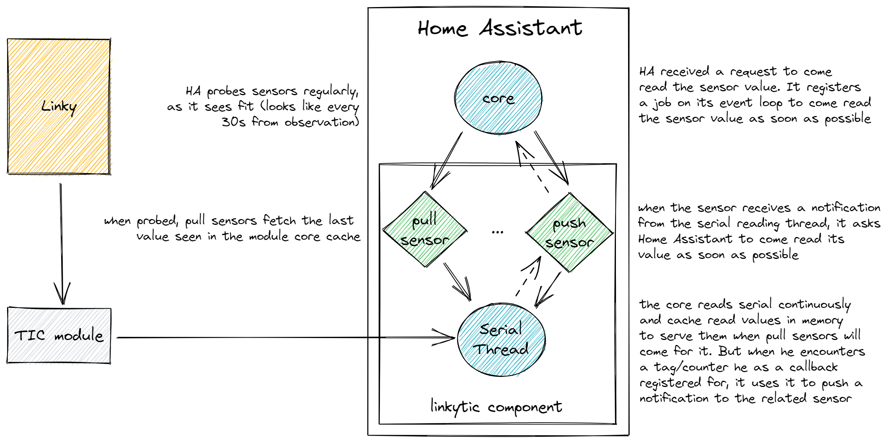

# Linky TIC - Support Linky dans Home Assistant

[](https://github.com/hekmon/linkytic/actions/workflows/hassfest.yaml)
[](https://github.com/hekmon/linkytic/actions/workflows/hacs.yaml)

<p align="center">
  
</p>

Cette intégration pour Home Assistant ajoute le support des Linky au travers de n'importe quelle connection série en provenance du module TIC (Télé Information Client) du compteur Linky. [Exemple sous Home Assistant](./res/SCR-20221223-ink.png).

## Matériel supporté 📠

L'intégration repose sur le module [serialx](https://puddly.github.io/serialx/) pour le transport des données. Tout matériel capable d'interfacer la lisaison TIC vers un flux de donnée numérique série est supporté.

Voici une liste (non-exhaustive) de module TIC/série testé par la communauté :

- [LiXee TIC-DINv2.0](https://lixee.fr/produits/45-tic-din-3770014375070.html), validé par [@Zehir](https://github.com/hekmon/linkytic/issues/65#issuecomment-3719982889);
- [Téléinfo 1 compteur USB rail DIN de Cartelectronic](https://www.cartelectronic.fr/teleinfo-compteur-enedis/17-teleinfo-1-compteur-usb-rail-din-3760313520028.html), validé par un [utilisateur](https://github.com/hekmon/linkytic/issues/2#issuecomment-1364535337);
- [Circuit à faire soi-même](https://miniprojets.net/index.php/2019/06/28/recuperer-les-donnees-de-son-compteur-linky/), nécessitant peu de composants, validé par un [utilisateur](https://github.com/hekmon/linkytic/pull/4#issuecomment-1368877730).
- [Autre article avec un circuit similaire](https://hallard.me/pitinfov12/)
- [Module Micro Téléinfo V3.0](https://github.com/hallard/uTeleinfo) à fabriquer soi-même ou pré-assemblé sur [Tindie](https://www.tindie.com/products/28873/).
- [Teleinfo ADTEK](https://doc.eedomus.com/view/T%C3%A9l%C3%A9info_USB_ADTEK) attention cependant [le baudrate ne semble pas standard](https://github.com/hekmon/linkytic/issues/40).
- et certainement bien d'autres !

🛜 En plus du matériel connecté directement à votre serveur, serialx supporte de nombreux transports séries à distance tels que `TCP`, `RFC2217` et `ESPHome`. Le dossier [serialserver](./serialserver) montre un exemple de retransmission série sur TCP/IP.

⚠️ Cette intégration n'est **pas** comptatible avec les modules Zigbee ! ⚠️

Théoriquement cette intégration est compatible avec les compteurs pré Linky qui possèdent un module TIC en choisissant le mode historique. Mais n'en ayant aucun dans mon entourage, je n'ai pas pu le vérifier.

## Informations remontées 🚀

Cette intégration va lire de manière continue les informations envoyées sur le TIC et stocker en mémoire la dernière valeur lue pour chacun des compteurs. Ensuite, Home Assistant viendra régulièrement lui même "récolter" les valeurs des différents sondes que l'intégration lui a déclaré. La fréquence observée semble être de 30 secondes. C'est largement suffisement pour la très grande majoritée des sondes.

Cependant, certaines sondes peuvent avoir de la valeur dans leur "instantanéité" (relative). Pour cela, l'intégration possède une option "temps réel" qui peut être activée. Celle-ci ne passera pas toutes les sondes en temps réel mais seulement celles pour qui cela peut avoir du sens (voir ci-dessous). Cette option temps réel notifiera Home Assistant qu'une nouvelle valeure est prête à être lue et lui demandera de venir la lire (et l'enregistrer) au plus vite à la différence des autres sondes dont les valeurs sont récupérées par Home Assistant, à son rythme.

Suivant la configuration que vous choisirez pour votre installation vous trouverez dans ce fichier dans la liste des sondes avec les annotations suivantes:

- \* sonde compatible avec le mode temps réel: si celui-ci est activé par l'utilisateur, les mises à jours seront bien plus fréquentes (dès qu'elles sont lues sur la connection série)
- \*\* sonde dont le mode temps réel est forcé même si l'utilisateur n'a pas activé le mode temps réèl dans le cas où la valeur de la sonde est importante et/ou éphémère

### Mode historique

Le mode historique est le plus commun (existant pré Linky) : il est activé par défault à moins que vous soyez producteur d'énergie.

#### Compteurs mono-phasé

Les 23 champs des compteurs mono-phasé configurés en mode historique sont supportés:

- `ADCO` Adresse du compteur (avec parsing EURIDIS en attributs étendus et périphérique agrégateur sous Home Assistant)
- `OPTARIF` Option tarifaire choisie
- `ISOUSC` Intensité souscrite
- `BASE` Index option Base
- `HCHC` Index option Heures Creuses - Heures Creuses
- `HCHP` Index option Heures Creuses - Heures Pleines
- `EJPHN` Index option EJP - Heures Normales
- `EJPHPM` Index option EJP - Heures de Pointe Mobile
- `BBRHCJB` Index option Tempo - Heures Creuses Jours Bleus
- `BBRHPJB` Index option Tempo - Heures Pleines Jours Bleus
- `BBRHCJW` Index option Tempo - Heures Creuses Jours Blancs
- `BBRHPJW` Index option Tempo - Heures Pleines Jours Blancs
- `BBRHCJR` Index option Tempo - Heures Creuses Jours Rouges
- `BBRHPJR` Index option Tempo - Heures Pleines Jours Rouges
- `PEJP` Préavis Début EJP (30 min)
- `PTEC` Période Tarifaire en cours
- `DEMAIN` Couleur du lendemain
- `IINST` Intensité Instantanée\*
- `ADPS` Avertissement de Dépassement De Puissance Souscrite\*\*
- `IMAX` Intensité maximale appelée
- `PAPP` Puissance apparente\*
- `HHPHC` Horaire Heures Pleines Heures Creuses
- `MOTDETAT` Mot d'état du compteur

#### Compteurs tri-phasés

⚠️ Actuellement en beta ⚠️

Des retours de log en `DEBUG` pendant l'émission de trames courtes sont nécessaires pour valider le bon fonctionnement de l'intégration sur ces compteurs, n'hésitez pas à ouvrir une [issue](https://github.com/hekmon/linkytic/issues) si vous avec un compteur triphasé pour aider à sa finalisation !

- `ADCO` Adresse du compteur (avec parsing EURIDIS en attributs étendus et périphérique agrégateur sous Home Assistant)
- `OPTARIF` Option tarifaire choisie
- `ISOUSC` Intensité souscrite
- `BASE` Index option Base
- `HCHC` Index option Heures Creuses - Heures Creuses
- `HCHP` Index option Heures Creuses - Heures Pleines
- `EJPHN` Index option EJP - Heures Normales
- `EJPHPM` Index option EJP - Heures de Pointe Mobile
- `BBRHCJB` Index option Tempo - Heures Creuses Jours Bleus
- `BBRHPJB` Index option Tempo - Heures Pleines Jours Bleus
- `BBRHCJW` Index option Tempo - Heures Creuses Jours Blancs
- `BBRHPJW` Index option Tempo - Heures Pleines Jours Blancs
- `BBRHCJR` Index option Tempo - Heures Creuses Jours Rouges
- `BBRHPJR` Index option Tempo - Heures Pleines Jours Rouges
- `PEJP` Préavis Début EJP (30 min)
- `PTEC` Période Tarifaire en cours
- `DEMAIN` Couleur du lendemain
- `IINST1` Intensité Instantanée (phase 1) \*pour les trames longues \*\*pour les trames courtes
- `IINST2` Intensité Instantanée (phase 2) \*pour les trames longues \*\*pour les trames courtes
- `IINST3` Intensité Instantanée (phase 3) \*pour les trames longues \*\*pour les trames courtes
- `IMAX1` Intensité maximale (phase 1)
- `IMAX2` Intensité maximale (phase 2)
- `IMAX3` Intensité maximale (phase 3)
- `PMAX` Puissance maximale triphasée atteinte
- `PAPP` Puissance apparente\*
- `HHPHC` Horaire Heures Pleines Heures Creuses
- `MOTDETAT` Mot d'état du compteur
- `ADIR1` Avertissement de Dépassement d'intensité de réglage (phase 1) \*\*trames courtes uniquement
- `ADIR2` Avertissement de Dépassement d'intensité de réglage (phase 2) \*\*trames courtes uniquement
- `ADIR3` Avertissement de Dépassement d'intensité de réglage (phase 3) \*\*trames courtes uniquement

### Mode standard

Une beta est actuellement en cours pour la future v3 supportant le mode standard, vous la trouverez dans les [releases](https://github.com/hekmon/linkytic/releases). N'hésitez pas à faire vos retours dans [#19](https://github.com/hekmon/linkytic/pull/19) afin d'accélére la sortie de beta du mode standard ! Si vous rencontrez un bug, vous pouvez aussi ouvrir une [issue](https://github.com/hekmon/linkytic/issues).

## Installation ⚙️

La configuration standard ou historique du compteur peut être vérifiée en naviguant dans l'interface du Linky jusqu'à la page `MODE TIC`.

### Raccordement à la prise TIC du compteur Linky

La plupart des modules TIC peuvent se raccorder à la prise Linky par un cable quelconque. Le circuit d'information se fait via les bornes I1 et I2 (pas de polarité). Enedis donne quelques informations sur les charactéristiques électiques du bus :

> Pour assurer son bon fonctionnement et le respect des caractéristiques électriques, la longueur maximale du bus d’information
> ne doit pas dépasser les 500 m (topologie quelconque).
> Les bornes de connexion du bus d'information consommateur font l’objet d’un isolement galvanique de l'électronique
> d'émission à l'intérieur des compteurs. L'électronique interne des appareils récepteurs fait l’objet d’un isolement galvanique du
> bus pour permettre le raccordement simultané de plusieurs récepteurs sur un même bus. L'objet de cette prescription est
> d'éviter les transits de courants de mode commun entre récepteurs.
> Le câble de raccordement est un câble téléphonique intérieur de type :
>
> - paire torsadée simple avec écran aluminium et conducteur de drain,
> - conducteur monobrin en cuivre étamé de diamètre 0,5 mm,
> - isolant PVC.
>
> [...]

§5.1 [Enedis-NOI-CPT_54E](./res/Enedis-NOI-CPT_54E.pdf)

Le bus TIC utilise une liaison simplex avec signal de porteuse. La qualité de la liaison (capacité du récepteur à correctement recevoir les données transmises) est très dépendante du cable utilisé (longueur et type).

Si vous recontrez des problèmes de réception des informations (liaison instable), il est fort à parier que le bus souffre d'interférences électromagnétiques. L'utilisation d'un cable téléphonique (Cat3) ou supérieur, avec paire torsadée et blindage, tel que recommandé par Enedis, permet généralement d'obtenir une liaison parfaitement stable. Certains récepteurs possèdent une résistance de terminaison variable qui peut être accordée pour limiter les réflexions électromagnétiques.

Pour des distances courtes (par exemple module dans la même gaine technique), torsader soi-même deux conducteurs suffit à réaliser une liaison stable. Un exemple de bon raccord est :



### Configuration du module

Une fois que votre module TIC est installé et connecté à votre compteur ainsi qu'un votre box domotique au travers de son cable USB, vous devriez voir apparaitre le périphérique `/dev/ttyUSB0` (ou `/dev/ttyUSB1` si vous aviez déjà une `/dev/ttyUSB0`).

Exemple de configuration pour le module de [LiXee](https://faire-ca-soi-meme.fr/domotique/2016/09/12/module-teleinformation-tic/):

- Mode historique

```bash
stty -F /dev/ttyUSB0 1200 sane evenp parenb cs7 -crtscts
```

- Mode standard

```bash
stty -F /dev/ttyUSB0 9600 sane evenp parenb cs7 -crtscts
```

Vérifiez que celui-ci fonctionne correctement en lancant la commande (Ctrl+C pour quitter):

```bash
cat /dev/ttyUSB0
```

Vous devriez voir défiler les informations du TIC.

### Téléchargement

Choississez l'une des 2 méthodes.

#### Avec HACS

[](https://my.home-assistant.io/redirect/hacs_repository/?owner=hekmon&repository=linkytic&category=integration)

Plus d'informations sur HACS [ici](https://hacs.xyz/).

#### Manuellement

Dans la page des [releases](https://github.com/hekmon/linkytic/releases) sélectionnez la version que vous souhaitez et téléchargez l'archive zip.

Copiez le dossier `custom_components/linkytic` dans votre dossier de configuration Home Assistant. Vous devriez maintenant avoir le dossier `/votre/config/dir/custom_components/linkytic` si vous avez `/votre/config/dir/configuration.yaml`.

Redémarrez votre Home Assistant !

### Activation et configuration dans Home Assistant

Une fois Home Assistant redémarré, allez dans: `Paramètres -> Appareils et services -> Ajouter une intégration`. Dans la fenêtre modale qui s'ouvre, cherchez `linky` et sélectionnez l'intégration s'appelant `Linky TIC` dans la liste (une petite icône d'un carton ouvert avec un texte de survol indiquant `Fourni par une extension personnalisée` devrait se trouver sur la droite).

Vous devriez passer sur le formulaire d'installation vous présentant les 3 champs suivants:

- `Chemin/Adresse vers le périphérique série` Ici renseignez le chemin de votre périphérique USB testé précédement. Le champ est rempli par default avec la valeur `/dev/ttyUSB0`: Il ne s'agit pas d'une auto détection mais simplement de la valeure la plus probable dans 99% des installations. Il est aussi possible d'utiliser toute URL supporté par [serialx](https://puddly.github.io/serialx/), ce qui peut s'avérer utile si le port série est connecté sur un appareil distant (support RFC2217, TCP, ESPHome).
- `Mode TIC` Choississez entre `Standard` et `Historique`. Plus de détails sur ces 2 modes en début de ce document.
- `Triphasé` À cocher si votre compteur est un compteur... triphasé.
- `Producteur` Si vous avez un abonnement producteur, uniquement en mode standard.

Validez et patientez pendant le temps du test. Celui-ci va tenter d'ouvrir une connection série sur le périphérique désigné et d'y lire au moins une ligne. En cas d'erreur, celle-ci vous sera retourné à l'écran de configuration. Sinon, votre nouvelle intégration est prête et disponible dans la liste des intégrations de la page où vous vous trouvez.

Pour ceux intéressé par le mode "temps réel", localisez l'intégration Linky TIC dans les tuiles de la page et cliquez sur `Configurer`.

## Développement

L'intégration suit les recommendation et bonnes pratiques de développement [Home Assistant](https://developers.home-assistant.io/docs/development_index/). Les tests unitaires sont réalisés avec [pytest](https://docs.pytest.org) et les analyseurs statiques avec [prek](https://prek.j178.dev). Les dépendances de développement peuvent-être installé avec pip:

```sh
pip install -r requirements_dev.txt
```

L'analyse statique (_ruff_, _mypy_, _prettier_) peut être lancé avec `prek`:

```sh
prek run --all-files
```

Il est preferrable de l'installer en crochet (_hook_) de git pour une execution automatique avant chaque commit:

```sh
prek install
```

Pour lancer les tests unitaires, utiliser `pytest`:

```sh
pytest tests
```

Pour les tests fonctionnels (avec Home Assistant), le plus simple est de lancer Home Assitant Core dans un terminal et l'émulateur TIC dans un autre. Pour lancer Home Assistant (génère le dossier config dans `.config`):

```sh
# Terminal 1
python -m homeassistant -c .config
# Terminal 2
python ./script/tic_emulator.py hist --tty /tmp/ttyHIST -s 012345678910 --threephase
```

L'interface HA est ensuite disponible sur [localhost:8123](localhost:8123).

### Architecture



**NOTE:** l'architecture a été fortement modifée pour utiliser la boucle d'évenement `asyncio` à la place d'un thread.

### Référence

Le document de référence du protocole TIC dévelopé par Enedis est [archivé dans ce repo](./res/Enedis-NOI-CPT_54E.pdf). Vous y trouverez toutes les informations nécessaire au dévelopement ainsi que des détails sur les informations remontées par ce plugin. Celui-ci et tout autre document de référence d'implémentation pouvant se trouver dans ce répertoire ne sont évidement pas couvert par la license MIT de ce repo et reste la propriété de leurs auteurs respectifs.
